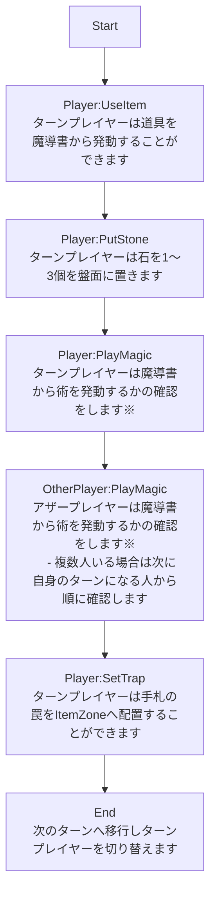
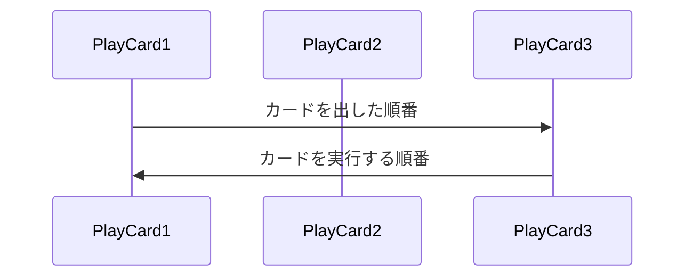

# 夜空の紡者

---
## Menu
---

[やりたいこと](#やりたいこと)
[ゲームの説明](#ゲームの説明)
[カードの種類](#カードの種類)
[用語](#用語)
[ゲームルール](#ゲームルール)

---
## やりたいこと
---

以下の内容を目的としています。
- ちょっとしたゲームを作りたい
- カードは購入以外にもトレードできるようにしたい
- 想定する範囲でユーザーに自由度を与えたい
  - カードプロテクターや魔導書、プレイマットの画像を添付することでItemを生成できるようにしたい
- 基本的にはどのプラットフォームでも遊べるようにしたい
  - プラットフォーム間でやりとりできるようにしたい
- セキュリティ性能を試したい
- 簡単に一つのプロジェクトをやり切りたい
  - 他にもネタがあるため少しでも数を減らしたい

---
## ゲームの説明
---

このゲームは星座をモチーフにした術カードと人の手で作られた道具のカードを用いて戦うボードゲームです。
お互いに一つの盤面に石を置き、おかれた石によって対戦者は術カードを利用することができます。
利用した術カードのポイントが10を超えると勝利になります。
相手が利用したい術を予測して戦うのがこのゲームの醍醐味になります。

また、簡単に遊ぶことができるPocketルールも存在します。
ルールの変更点は石を盤面において、その位置がそろうまで発動できない術が良しの個数によって発動できるようになります。

---
## カードの種類
---

基本は3つに分かれます。
- 術
- 通常道具
- 罠道具

#### 術 
盤面の指定された石を取り除いて発動できます。
相手の術に応じて発動することもできます。
石を取り除けない場合は発動に失敗します。

#### 通常道具
ItemZoneへ出す事で発動できます。

#### 罠道具
一度ItemZoneへ伏せてから発動できます。

---
## 術の属性
---
術にはそれぞれ以下のようなパラメーターが存在します
- Spring
- Summer
- Autumn
- Winter

---
## 用語
---

#### 魔術師
ゲームの参加者全員を指します。
魔術師はカードに様々な効果を封じ込めており、カードを利用することでその効果を解き放つことができます。

#### 発動
カードの内容を解き放つことを言います。

#### 効果
発動時もしくは発動後に行われるカードに記載された実施する内容になります。
効果には次のものがあります。
- Entry
  - 発動時に1回だけ実施する効果です
- Stay
  - 発動後、対象のZoneに存在する限り行う効果です
- Exit
  - 対象のZoneから離れる時に1度だけ実施する効果です

#### プレイスタック
カードを発動する際に順番を決めるための概念です
プレイヤーが特定のカードを発動する際に重ねていき、最後に発動したカードから順番に効果を実施します

#### 解放
一部のカードが持つ内容です。
カードを重ね合わせて強力な状態にすることを指します。

#### ライブラリ
別名:魔導書と呼びます
ゲーム開始時に手に持っているカード群です。
28～40枚で構成された道具・術カードで同じ名前のカードは3枚まで入れられます。

#### フィールド
ゲームを行うための場所になります。
フィールドは以下の構成になります。

- 盤面
  - 石を置く場所です
  - 13×13のマス目上に配置します
- MagicZone
  - 発動した術カードを置く場所です
  - ここに配置されたカードのポイントが10点を超えると勝利になります
- ItemZone
  - 道具カードを置く場所です
  - 道具カードは3枚までおけます
    - 道具カードが3枚伏せられてしまうと、ライブラリから道具カードを発動することはできません
- TrashZone
  - 使用後の条件にてカードを置く場所です

#### 石
ゲームの要となる要素です。
石の配置により魔術師の持つカードが反応を起こし、発動することができます。

#### ターン
ターンはゲーム中における手順の巡回数になります。
各ターンによって操作できるプレイヤーは順番に変わります。

#### プレイヤー
現在プレイヤーは次の種類存在します
- 現在石を置くプレイヤーのことをターンプレイヤーと言います
- 置かないプレイヤーをアザープレイヤーと言います
- カードの実施者をユーザーと言います

#### アイテム
ゲームで利用するための装飾品になります。
- 魔導書
  - Libraryを入れるためのケース
- カードプロテクター
  - Cardの背景を変えるためのアイテム
- プレイマット
  - 自分のフィールドを装飾するカード位置

---
## ゲームルール
---

- カードに記載されているPTが10点以上になったプレイヤーが勝利します
- ライブラリのカードを手札として保持します
- 先攻後攻を決めます

#### 以降は次の手順にのっとって操作します

1. UseItemに入場したプレイヤーは魔導書及びItemZoneに存在する道具を選択して発動できます。
   - 以降のプレイヤーは最後に発動したプレイヤー以外全員がItemZoneにある罠を発動しないまで繰り返します
2. PlayMagicに入場し他プレイヤーは魔導書から術を選択して発動できます。
    - 以降のプレイヤーは最後に発動したプレイヤー以外が魔導書から術及びItemZoneから罠を発動しないまで繰り返します

場に出した全てのカードは最後に出されたカードから順に処理を行います。
以下の図はカードの出た順番と実行する順番を表したものです。

**術の発動を宣言したが石が取り除けない場合、発動失敗となりその術カードはTrashZoneへ置きます**

