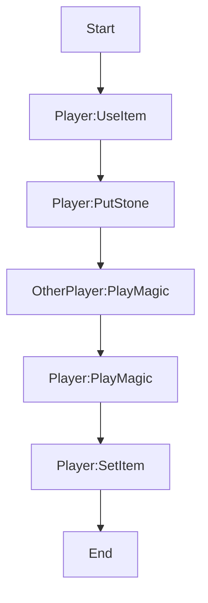
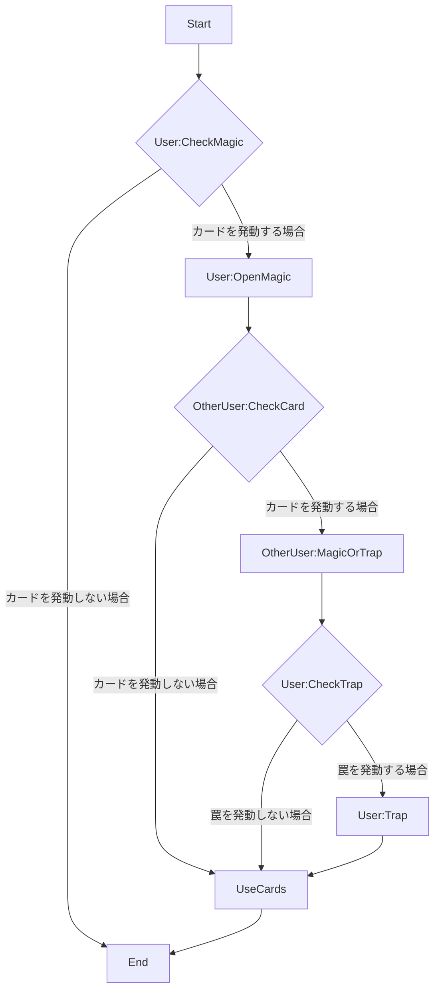
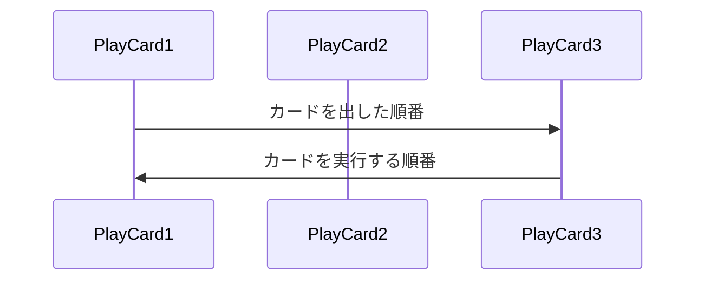

# 夜空の紡者

---
## Menu
---

[やりたいこと](#やりたいこと)
[ゲームの説明](#ゲームの説明)
[カードの種類](#カードの種類)
[用語](#用語)
[ゲームルール](#ゲームルール)

---
## やりたいこと
---

以下の内容を目的としています。
- ちょっとしたゲームを作りたい
- カードは購入以外にもトレードできるようにしたい
- 想定する範囲でユーザーに自由度を与えたい
  - カードプロテクターや魔導書、プレイマットの画像を添付することでItemを生成できるようにしたい
- 基本的にはどのプラットフォームでも遊べるようにしたい
  - プラットフォーム間でやりとりできるようにしたい
- セキュリティ性能を試したい
- 簡単に一つのプロジェクトをやり切りたい
  - 他にもネタがあるため少しでも数を減らしたい

---
## ゲームの説明
---

このゲームは星座をモチーフにした術カードと人の手で作られた道具のカードを用いて戦うボードゲームです。
お互いに一つの盤面に石を置き、おかれた石によって対戦者は術カードを利用することができます。
利用した術カードのポイントが10を超えると勝利になります。
相手が利用したい術を予測して戦うのがこのゲームの醍醐味になります。

また、簡単に遊ぶことができるPocketルールも存在します。
ルールの変更点は石を盤面において、その位置がそろうまで発動できない術が良しの個数によって発動できるようになります。

---
## カードの種類
---

基本は3つに分かれます。
- 術
- 通常道具
- 罠道具

#### 術 
盤面の指定された石を取り除いて発動できます。
相手の術に応じて発動することもできます。
石を取り除けない場合は発動に失敗します。

#### 通常道具
ItemZoneへ出す事で発動できます。

#### 罠道具
一度ItemZoneへ伏せてから発動できます。

---
## 術の属性
---
術にはそれぞれ以下のようなパラメーターが存在します
- Spring
- Summer
- Autumn
- Winter

---
## 用語
---

#### 魔術師
ゲームの参加者全員を指します。
魔術師はカードに様々な効果を封じ込めており、カードを利用することでその効果を解き放つことができます。

#### 発動
カードの内容を解き放つことを言います。

#### 解放
一部のカードが持つ内容です。
カードを重ね合わせて強力な状態にすることを指します。

#### ライブラリ
20～30枚で構成された術カードで同じ名前のカードは2枚まで入れられます。

#### 道具袋
道具カードを用意したものになります。
こちらもライブラリと同じで同じ名前のカードは2枚まで入れられます。

#### フィールド
ゲームを行うための場所になります。
フィールドは以下の構成になります。

- 盤面
  - 石を置く場所です
  - 13×13のマス目上に配置します
- MagicZone
  - 発動した術カードを置く場所です
  - ここに配置されたカードのポイントが10点を超えると勝利になります
- ItemZone
  - 道具カードを置く場所です
  - 道具カードは3枚までおけます
    - 道具カードが3枚伏せられてしまうと、ライブラリから道具カードを発動することはできません
- TrashZone
  - 使用後の条件にてカードを置く場所です

#### 石
ゲームの要となる要素です。
石の配置により魔術師の持つカードが反応を起こし、発動することができます。

#### 手札
手荷物カードを指します。
ゲーム開始時にライブラリと道具袋のカードを全て手札にします。
手に持つカードで条件を満たしたカードを発動することができます。

#### ターン
ターンはゲーム中における手順の巡回数になります。
各ターンによって操作できるプレイヤーは順番に変わります。

#### プレイヤー
現在プレイヤーは次の種類存在します
- 現在石を置くプレイヤーのことをターンプレイヤーと言います
- 置かないプレイヤーをアザープレイヤーと言います
- カードの実施者をユーザーと言います

#### アイテム
ゲームで利用するための装飾品になります。
- 魔導書
  - Libraryを入れるためのケース
- カードプロテクター
  - Cardの背景を変えるためのItem
- プレイマット
  - 自分のフィールドを装飾するカード位置

---
## ゲームルール
---

- カードに記載されているPTが10点以上になったプレイヤーが勝利します
- ライブラリのカードを手札として保持します
- 先攻後攻を決めます

#### 以降は次の手順にのっとって操作します

1. UseItem
  ターンプレイヤーは道具を手札から利用します
2. PutStone
  ターンプレイヤーは石を1～3個を盤面に置きます
3. OtherPlayer:PlayMagic
  アザープレイヤーは手札から術を利用するかの確認をします※
    - 複数人いる場合は次に自身のターンになる人の順に確認します
4. Player:PlayMagic
  ターンプレイヤーは手札から術を利用するかの確認をします※
5. SetItem
  ターンプレイヤーは手札の罠道具をItemZoneへ配置することができます
6. End
  次のターンへ移行しターンプレイヤーを切り替えます

#### 上記の手順のうち、PlayMagicの部分の詳細手順を記述します

1. CheckMagic
プレイヤーは石の配置に基づき、手札にあるカードを利用するか確認し、利用しない場合はこの時点でこの手順を終了します
2. OpenMagic
ユーザーは術を場に出します
3. OtherUser:CheckCard
ユーザーではないプレイヤーは術と罠を確認します。
4. OtherUser:OpenMagicOrTrap
3でカードを発動する場合ユーザーではないプレイヤーはカードを場に出します。
5. User:Trap
4に対してユーザープレイヤーは罠を利用する場合、表にしてカードを発動ます
6. UseCards
場に出した全てのカードは最後に出されたカードから順に処理を行います。
以下の図はカードの出た順番と実行する順番を表したものです。

