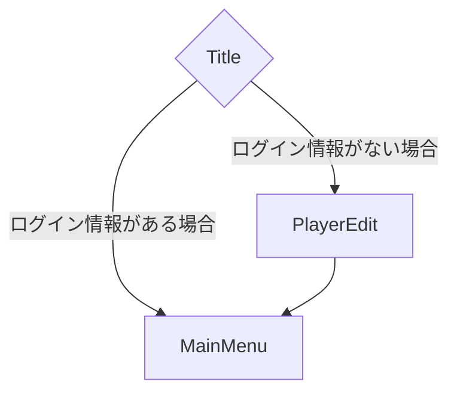
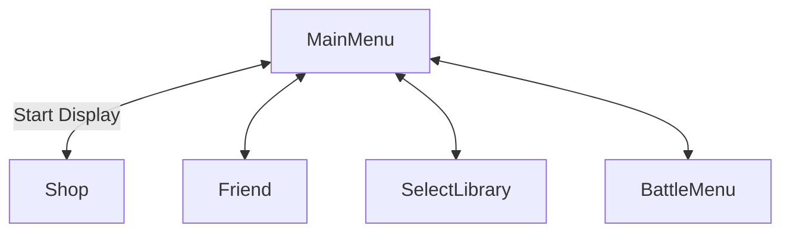
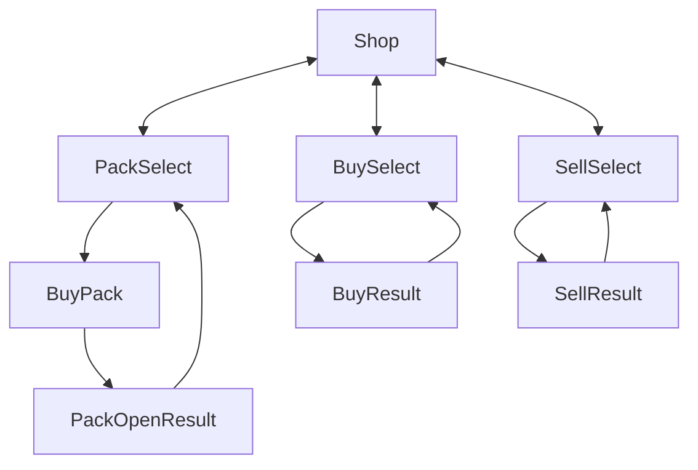
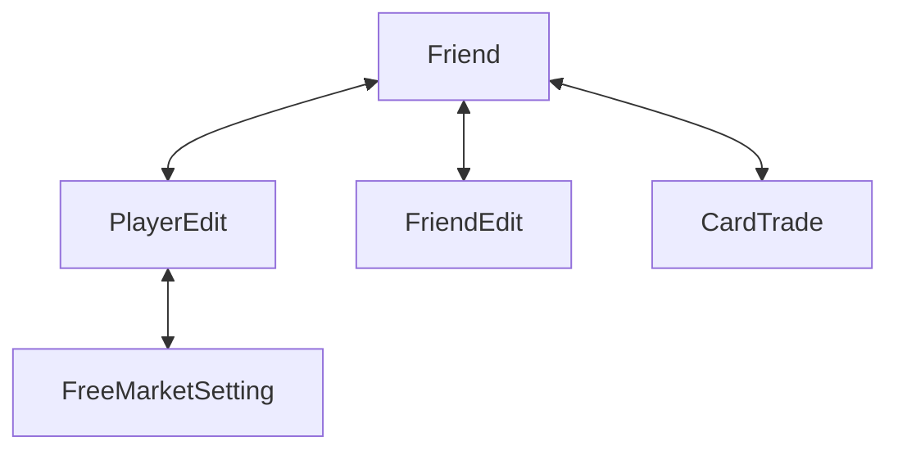
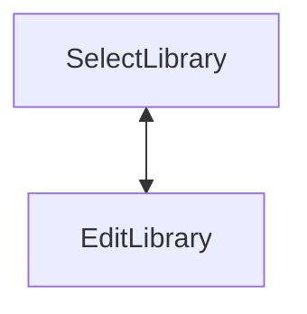
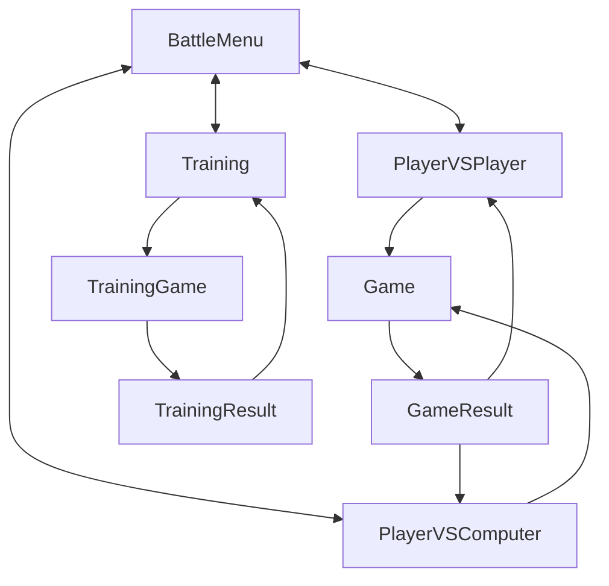

# 画面設計書

- Title
- Shop
  - PackSelect
    - BuyPack
      - PackOpenResult
  - BuySelect
    - BuyResult
  - SellSelect
    - SellResult
- Friend
  - PlayerEdit
    - FreeMarketSetting
  - FriendEdit
  - CardTrade
- SelectLibrary
  - EditLibrary
- BattleMenu
  - PlayerVSPlayer
    - Game
      - Result
  - PlayerVSComputer
    - Game
      - Result
  - Training
    - TrainingGame
      - TrainingResult

### Title
タイトル画面
- 背景にアニメーションを含めたい
- 画面をタップすることでメニューへ移動する。メニューはTopが`PackSelect`へ移動する。

### Shop
ショップ画面
以下の機能を保持した画面です
- 購入
  - Packの購入
  - カードの単品購入
  - アイテムの購入
  - UserのFreeMarket
- 売却
  - カードの売却
  - アイテムの売却

### Training
トレーニング画面
- 

# 画面遷移図

### Main Display

### MainMenu Display

### Shop Display

### Friend Display

### Library Display

### BattleMenu Display

