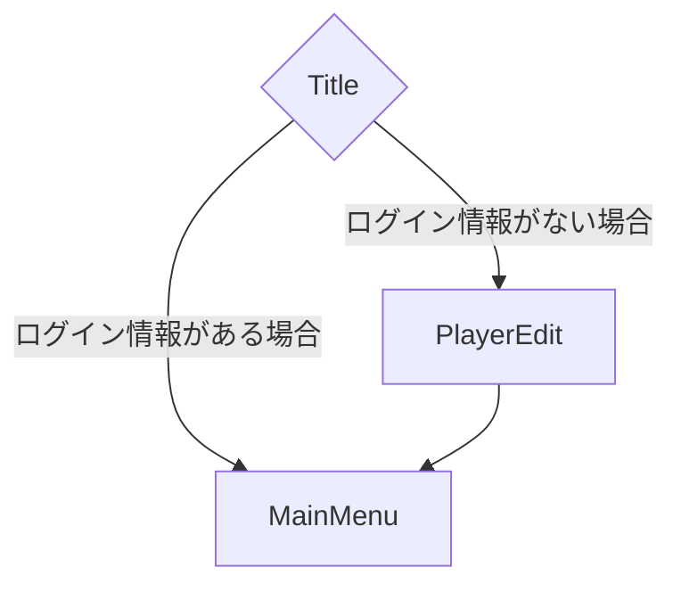
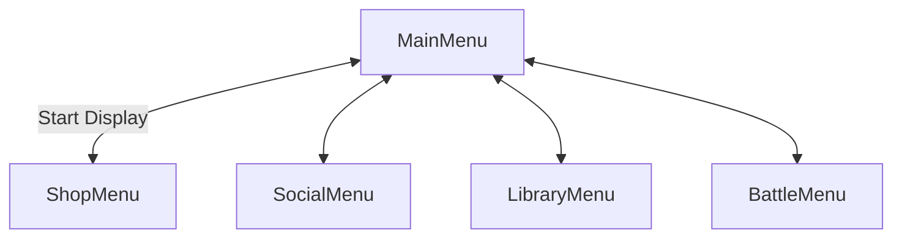
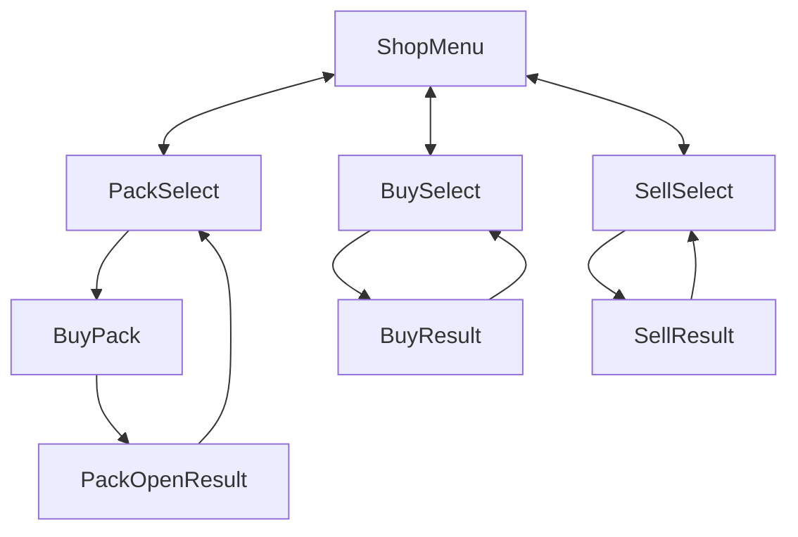
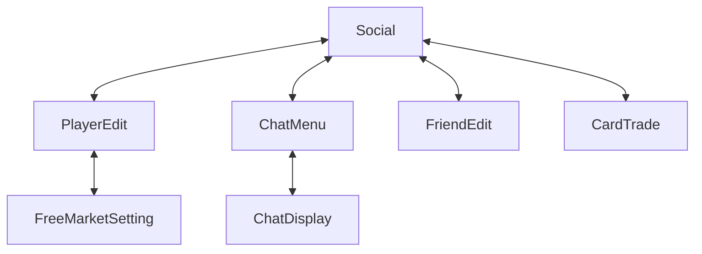
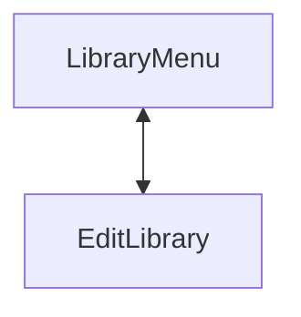
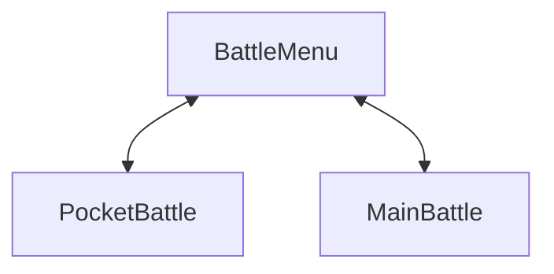
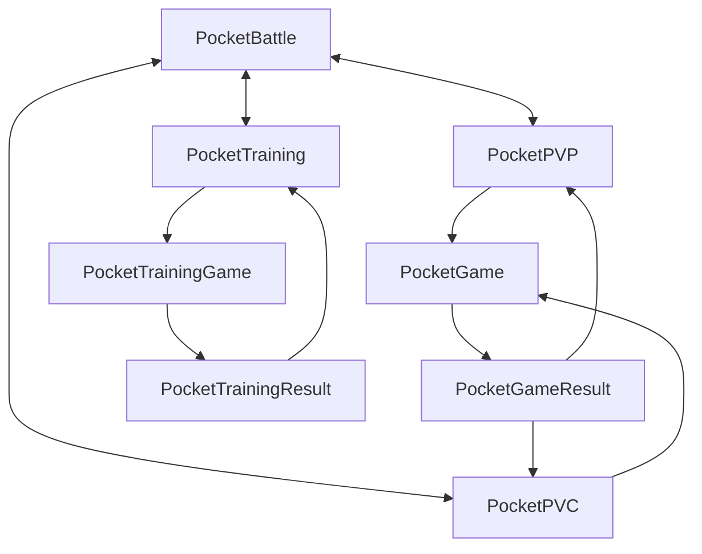
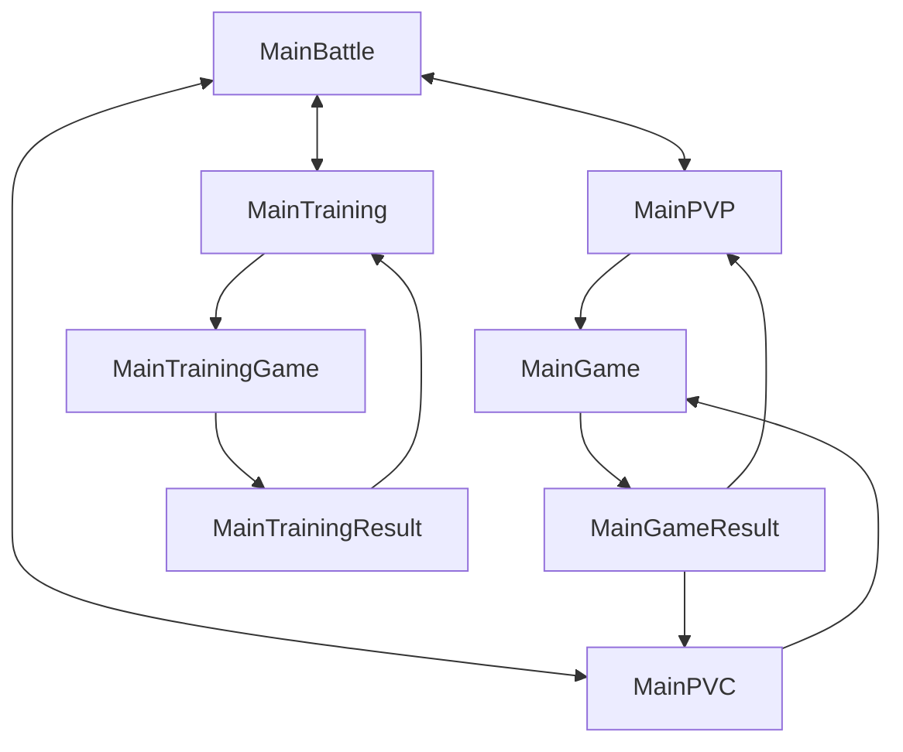

# 画面遷移図

### Main Display

```mermaid
graph TD;

Title{Title}

Title-->|ログイン情報がある場合|MainMenu
Title-->|ログイン情報がない場合|PlayerEdit
PlayerEdit-->MainMenu

```

### MainMenu Display

```mermaid
graph TD;

MainMenu<-->|Start Display|ShopMenu
MainMenu<-->SocialMenu
MainMenu<-->LibraryMenu
MainMenu<-->BattleMenu

```

### ShopMenu Display

```mermaid
graph TD;

ShopMenu<-->PackSelect
PackSelect-->BuyPack
BuyPack-->PackOpenResult
PackOpenResult-->PackSelect
ShopMenu<-->BuySelect
BuySelect-->BuyResult
BuyResult-->BuySelect
ShopMenu<-->SellSelect
SellSelect-->SellResult
SellResult-->SellSelect

```

### SocialMenu Display

```mermaid
graph TD;

Social<-->PlayerEdit
PlayerEdit<-->FreeMarketSetting
Social<-->ChatMenu
ChatMenu<-->ChatDisplay
Social<-->FriendEdit
Social<-->CardTrade

```

### LibraryMenu Display

```mermaid
graph TD;

LibraryMenu<-->EditLibrary

```

### BattleMenu Display

```mermaid
graph TD;

BattleMenu<-->PocketBattle
BattleMenu<-->MainBattle

```

#### PocketBattle

```mermaid
graph TD;

PocketBattle<-->PocketPVP
PocketBattle<-->PocketPVC
PocketPVP-->PocketGame
PocketPVC-->PocketGame
PocketGame-->PocketGameResult
PocketGameResult-->PocketPVP
PocketGameResult-->PocketPVC
PocketBattle<-->PocketTraining
PocketTraining-->PocketTrainingGame
PocketTrainingGame-->PocketTrainingResult
PocketTrainingResult-->PocketTraining
```

#### MainBattle Display

```mermaid
graph TD;

MainBattle<-->MainPVP
MainBattle<-->MainPVC
MainPVP-->MainGame
MainPVC-->MainGame
MainGame-->MainGameResult
MainGameResult-->MainPVP
MainGameResult-->MainPVC
MainBattle<-->MainTraining
MainTraining-->MainTrainingGame
MainTrainingGame-->MainTrainingResult
MainTrainingResult-->MainTraining

```
