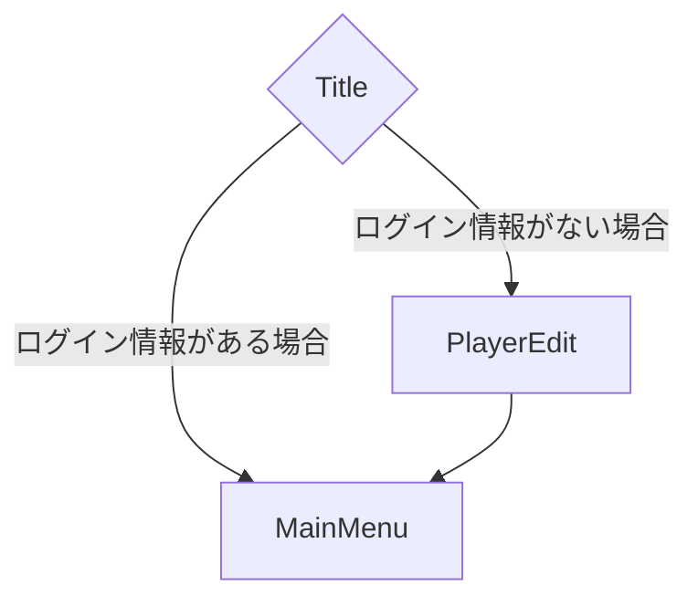
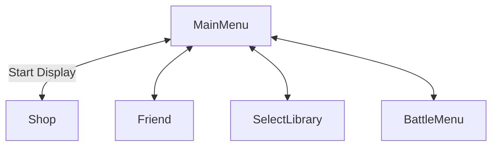
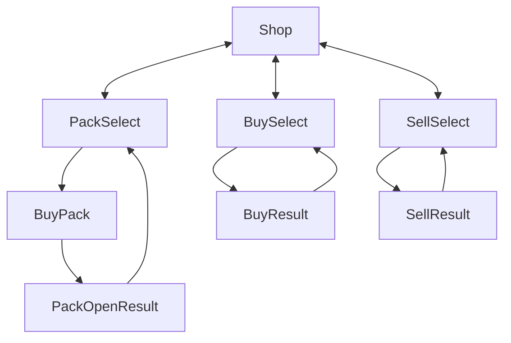
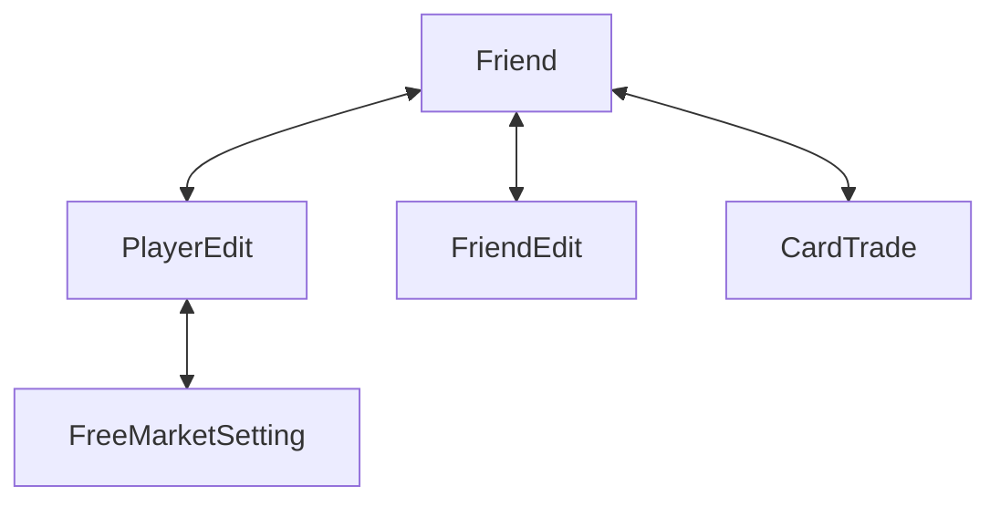
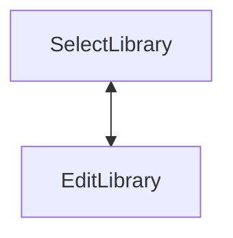
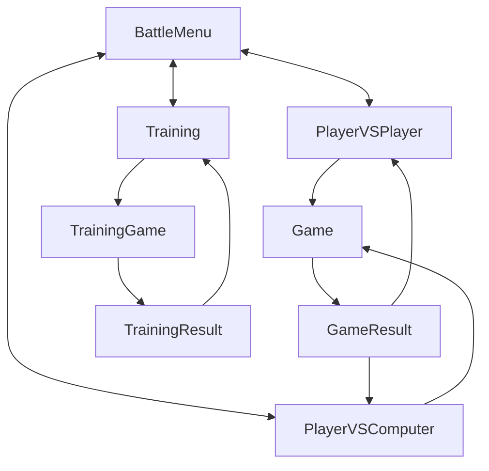

# 機能要件
- 以下のクロスプラットフォームにしたい
  - Windows
  - Android
  - Web
- メッセージのやり取りを行えるようにしたい
- カードをトレードできるようにしたい
- 通信対戦ができるようにしたい
- 複数人対戦を実装したい
- リプレイ機能を付けたい
- CPU対戦を追加したい
- 以下の要素でふるやかにしたい
  - プレイマット
    - 自分の陣地に配置するカードを置くための場所
  - 魔導書
    - 手札のカードを入れておく物
    - 各ページにサブタイトルを付ける機能を追加したい
  - カードプロテクター
    - カードの背面のデザインを変える機能を追加したい
  - 特定の内容で実施する機能に以下のものを追加したい
    - コイン
    - ダイス
  - 

# 画面設計書

- Title
- Shop
  - PackSelect
    - BuyPack
      - PackOpenResult
  - BuySelect
    - BuyResult
  - SellSelect
    - SellResult
- Friend
  - PlayerEdit
    - FreeMarketSetting
  - FriendEdit
  - CardTrade
- SelectLibrary
  - EditLibrary
- BattleMenu
  - PlayerVSPlayer
    - Game
      - Result
  - PlayerVSComputer
    - Game
      - Result
  - Training
    - TrainingGame
      - TrainingResult

### Title
タイトル画面
- 背景にアニメーションを含めたい
- 画面をタップすることで`Menu`へ移動する。`Menu`はTopが`Shop`へ移動する。
- このタイミングでアカウントの認証を行いたい

### Menu
- 画面構成として次のようにする予定
  - Menuを土台としてShopと

#### Shop
ショップ画面
以下の機能を保持した画面です
- 購入
  - Packの購入
  - カードの単品購入
  - アイテムの購入
  - UserのFreeMarket
- 売却
  - カードの売却
  - アイテムの売却

### Training
トレーニング画面
- 

# 画面遷移図

### Main Display

### MainMenu Display

### Shop Display

### Friend Display

### Library Display

### BattleMenu Display

